
<h1 align="center">校车调度管理系统</h1>

## 简介
校车调度管理系统：基于Spring Boot，角色分为管理员、用户，功能包括车辆信息管理、调度计划生成、实时定位跟踪、学生安全管理，提高校车调度及运营效率。    --计算机毕业设计源码；毕设源码；java毕业设计源码

## 联系方式

<h3 align="center">获取完整代码与数据库文件 + 微信：deepguan QQ: 86050149 QQ群: 783742310</h3>

<h3 align="center">可帮忙远程部署 包运行成功！提供远程部署、修改代码、设计文档指导、代码讲解等服务！</h3>

## 功能介绍（完整见运行截图）
管理员：基于Spring Boot开发的校车调度管理系统，能够管理校车信息、驾驶员信息以及实时监控校车位置，确保调度的准确性和安全性。具备系统首页、个人中心、车辆信息管理、车辆调度管理等模块，支持查看和编辑校车及驾驶员数据，生成并优化调度计划。

驾驶员：在系统中录入和维护个人信息，包括工号、姓名、驾龄、联系方式等，并实时接收调度指令。可以查看个人相关调度计划和校车信息，确保安全按时完成接送任务。

调度员：负责输入和管理调度信息，如校车派车编号、出发和到达时间、起点、终点、乘车人数、带班老师等。能够使用系统提供的工具进行校车调度的计划安排，实时查看校车的位置信息，并与驾驶员保持沟通。

学生/家长：通过系统了解校车的实时位置和预计到达时间，确保安全接送。管理员可以为学生录入乘车信息，家长可以通过系统查看和管理学生的信息，提高安全性和便利性。

## 运行截图
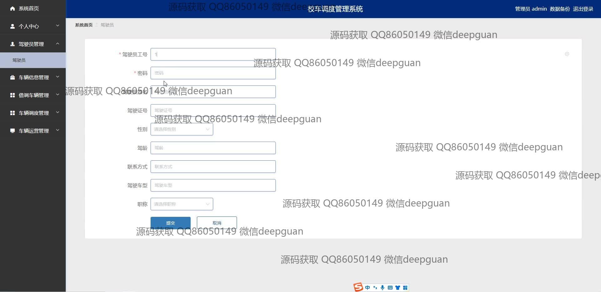
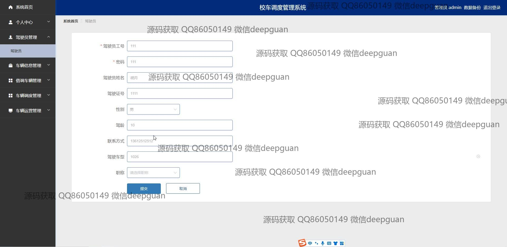
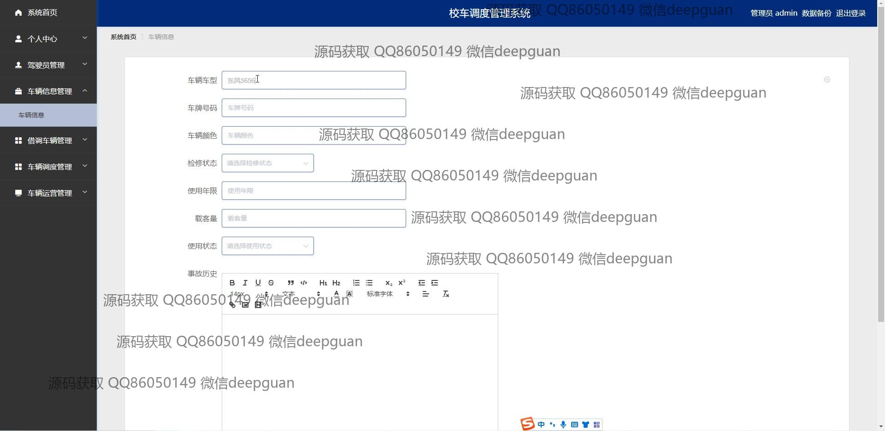
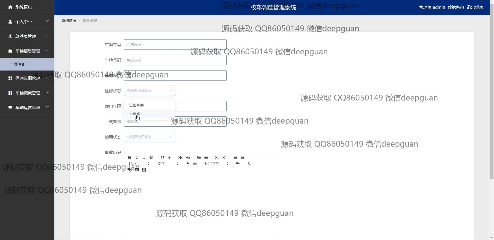
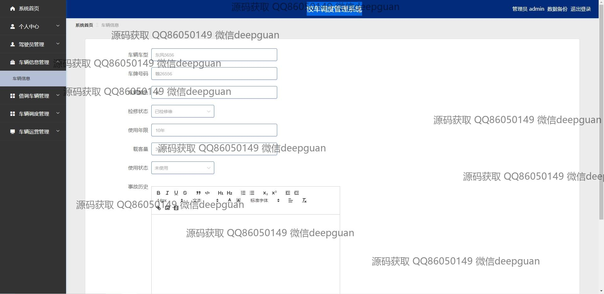
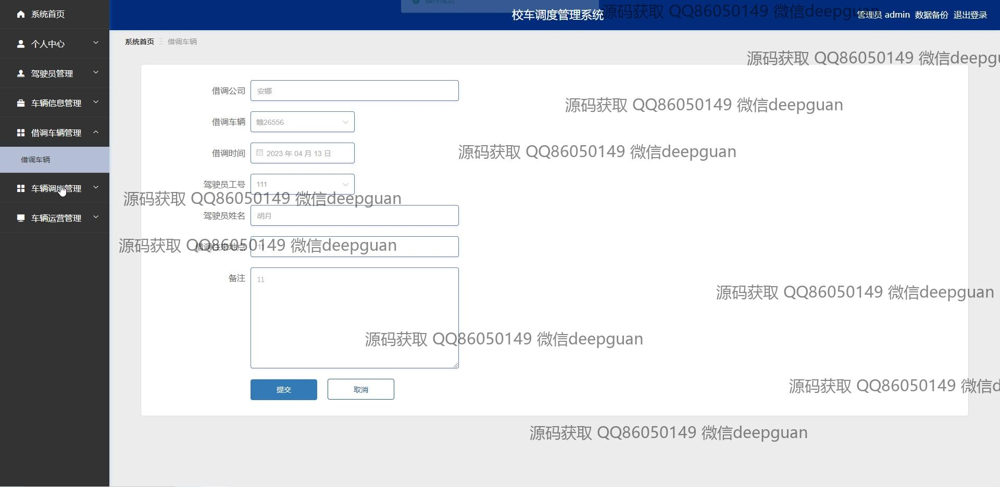
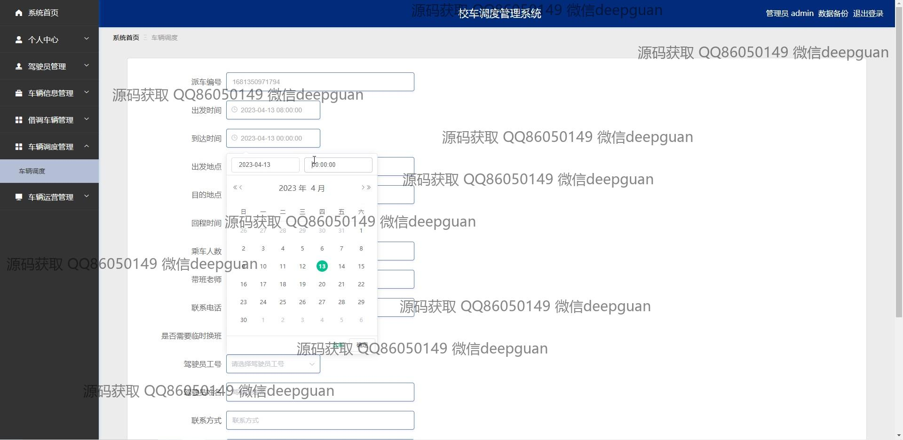
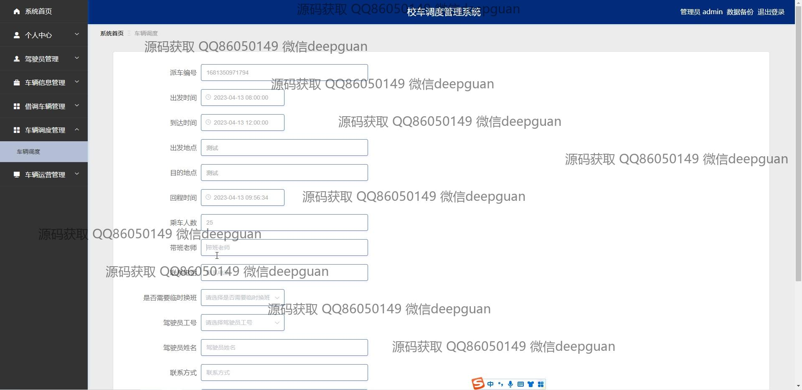
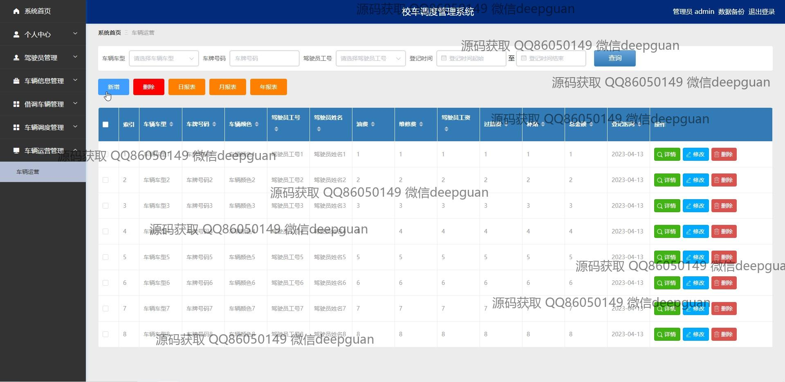
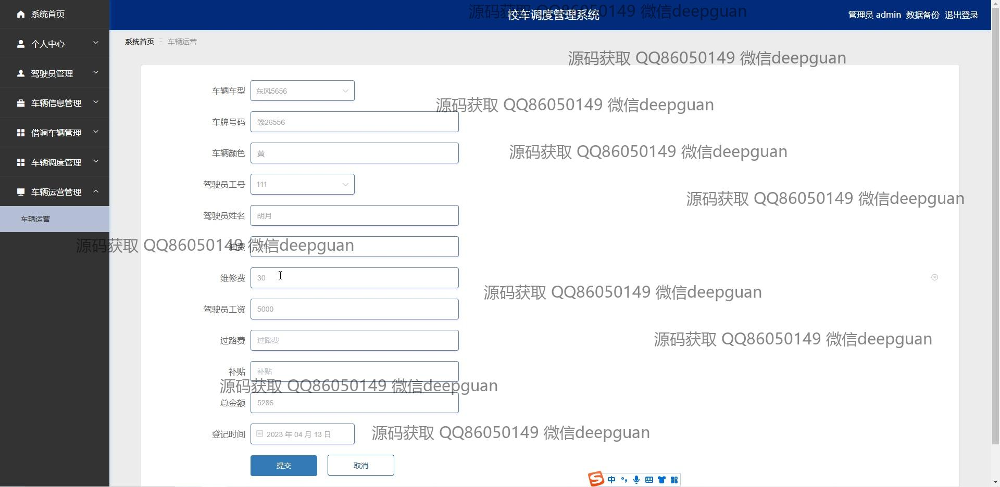
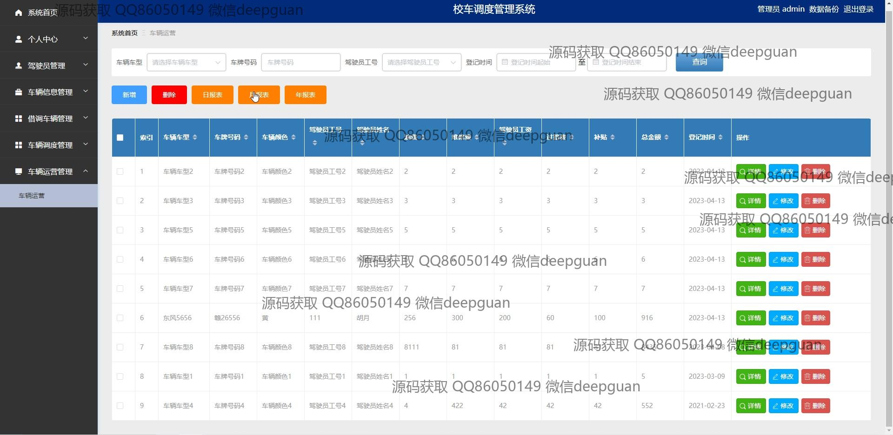
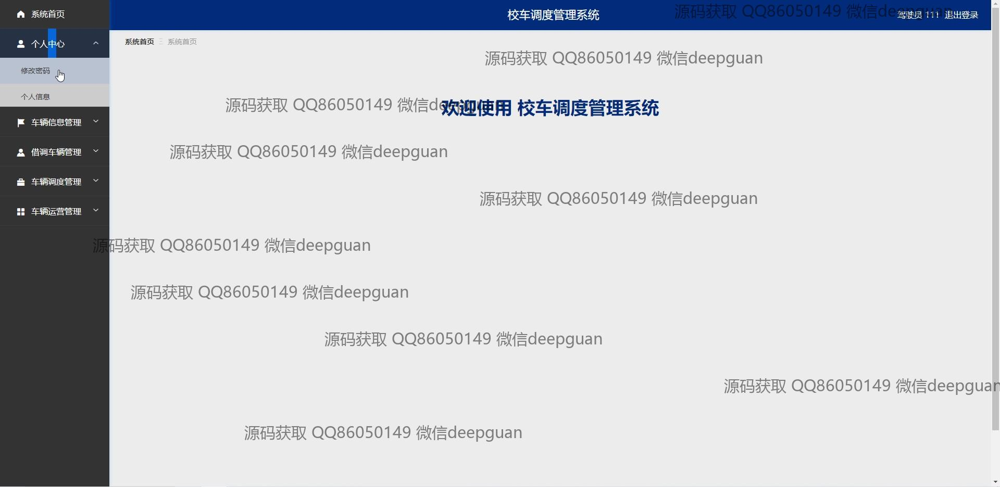

本代码来源于网络,仅供学习参考使用!

